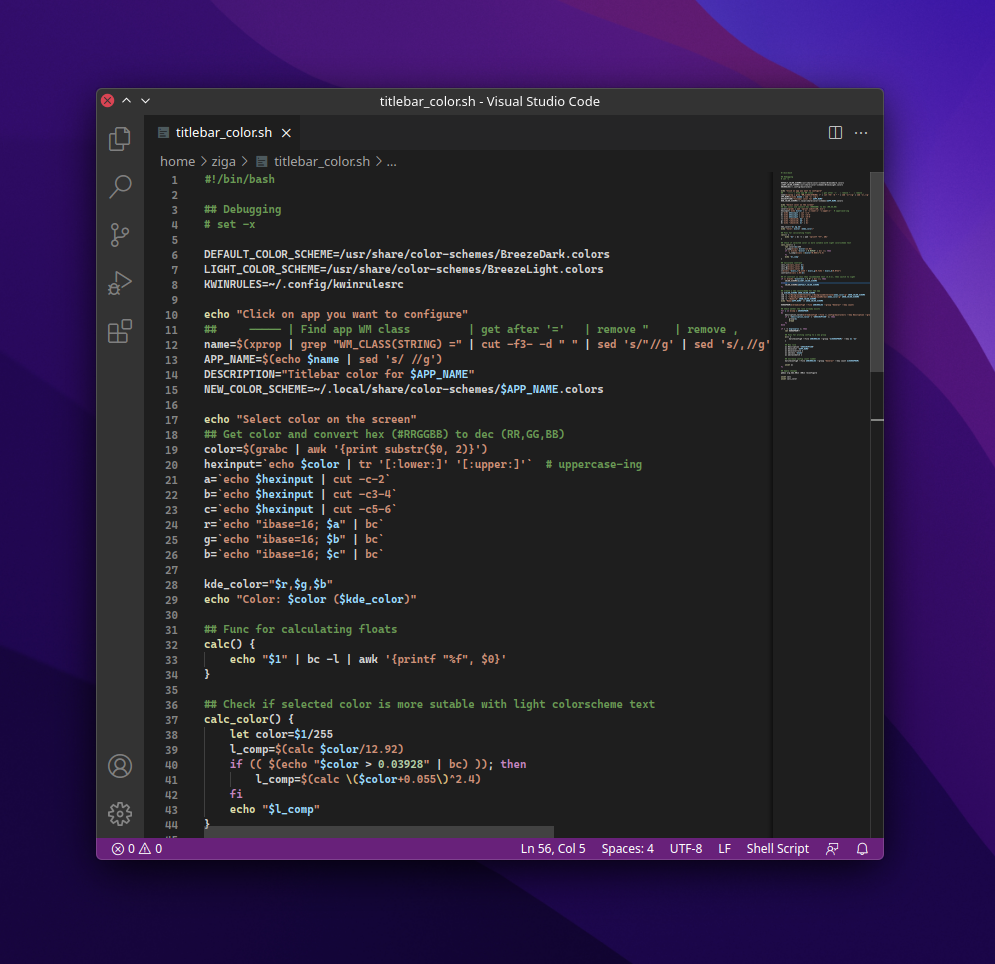
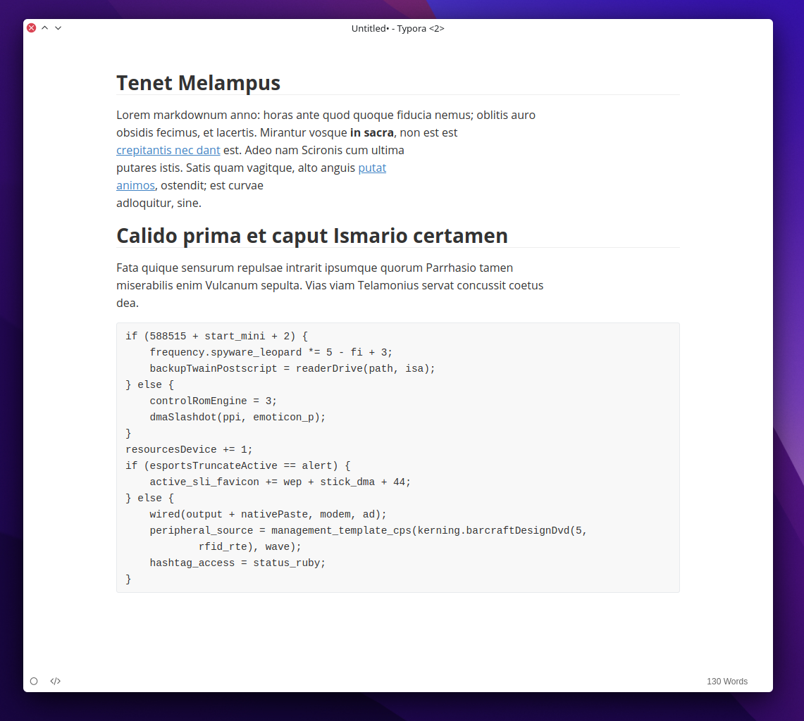

# Titlebar Kolor Picker

Simple titlebar color changer for KDE

## Description

Titlebar Kolor Picker (or tkp) is a simple interactive shell script that lets you choose application/window specific titlebar color-scheme. This is useful when titlebar feels out of place on GUI applications that do not utilize KDE's colors or when app's CSD (Client side rendering) breaks window decoration consistency.

here are some examples how it can help make UI clean and a bit more modern.

### Firefox


### Visual Studio Code



### Typora




## Installation

### Prerequisites

- xprop
- grabc
- X11 session (wayland not tested nor supported. The script uses X11 tools)

### Getting the script

Download the script by cloning the repository 

```git clone https://github.com/siggsy/Tkp```

or by downloading the script `tkp` directly from the browser and placing it in the folder in PATH. Make sure the script is executable `chmod +x tkp`

### Remove overrides

All the rules can be removed by going to `Window Rules` and deleting the rule named  `Titlebar color for your-app`.


## How it works

The script first uses `xprop` to acquire window's `WM_CLASS` used for KDE's window rules to apply color only to that specific app. Next, the script will ask you to click on a color that you wish to use for the titlebar. Selected color is then evaluated and based on contrast standards it selects the right color-scheme variant to override so title text is visible even on white titlebars ([see Typora example](#typora)).

The screen uses then creates a new color-scheme, by default overriding BreezeDark and as only the titlebar color-scheme is being overridden, changing every occurrence of BackgroundNormal and BackgroundAlternate does the trick. These overrides are stored under `~/.config/kwinrulesrc`.


## Known bugs

- Picking color from Konsole always returns #000000


## TODO

[] Re-apply configuration after modifying  existing color scheme

[] Show prompt asking if the automatic color-scheme selection is correct/preferred 