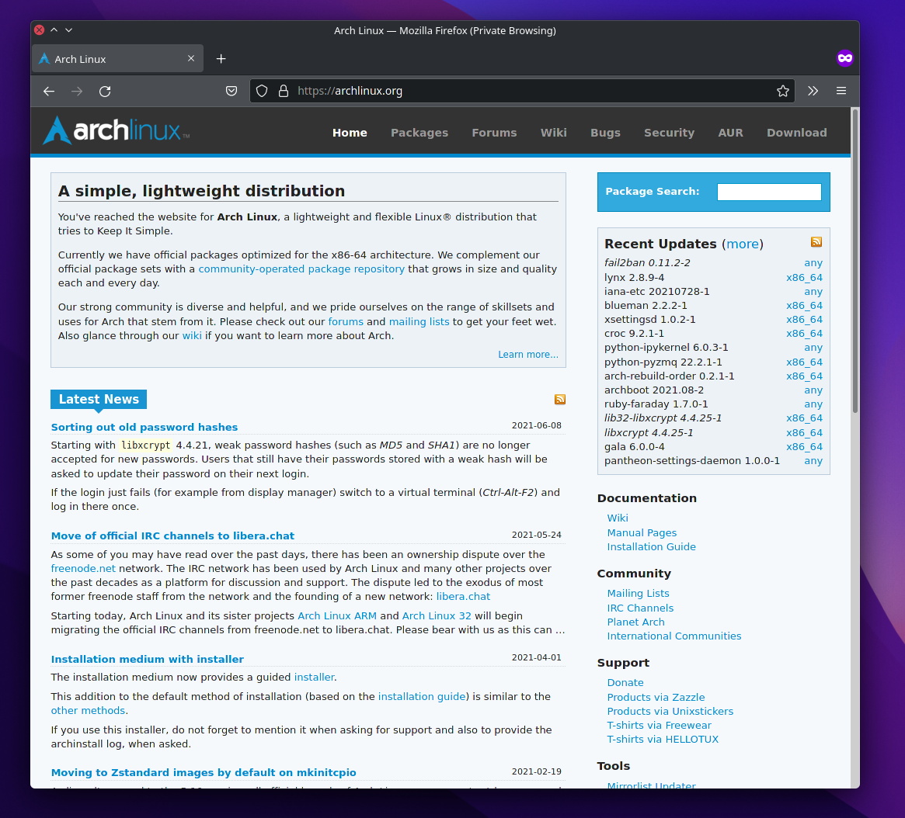
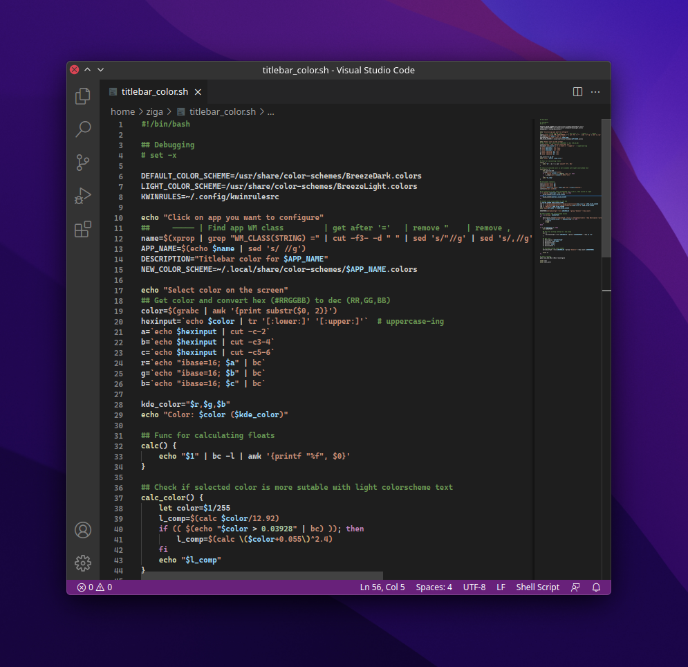
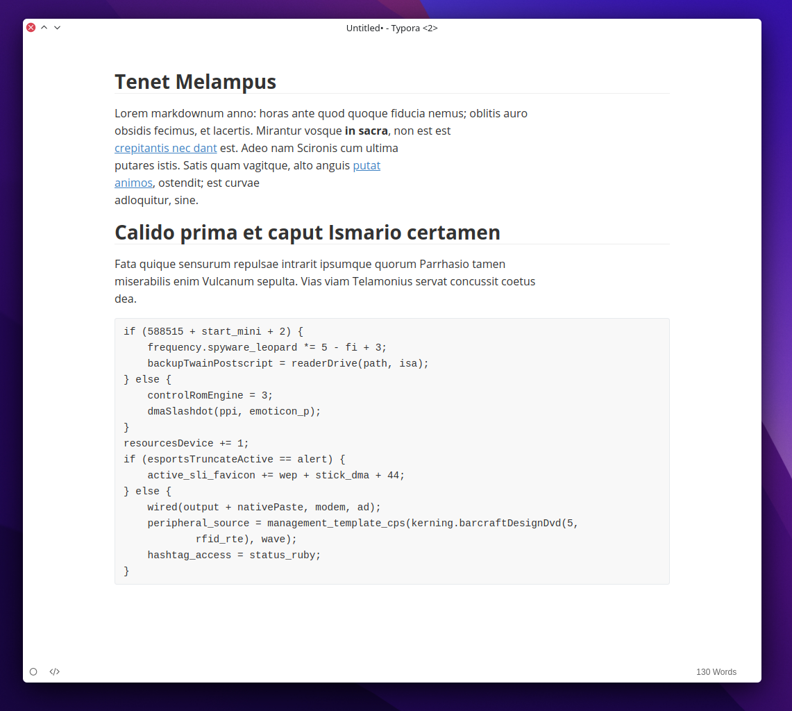

# Titlebar Kolor Picker

Simple titlebar color changer for KDE

## Description

Titlebar Kolor Picker (or tkp) is a simple interactive shell script that lets you choose application/window specific titlebar color-scheme. This is useful when titlebar feels out of place on GUI applications that do not utilize KDE's colors or when app's CSD (Client side rendering) breaks window decoration consistency.

here are some examples how it can help make UI clean and a bit more modern.

### Firefox


### Visual Studio Code


### Typora



## Installation

### Prerequisites

- xprop
- kcolorchooser
- bc
- X11 session (wayland not tested nor supported. The script uses X11 tools)

### Getting the script

Download the script by cloning the repository 

```git clone https://github.com/siggsy/Tkp```

or by downloading the script `tkp` directly from the browser and placing it in the folder in PATH. Make sure the script is executable `chmod +x tkp`

### Remove overrides

All the rules can be removed by going to `Window Rules` and deleting the rule named  `Titlebar color for your-app`.


## Usage

`tkp` - Interactive mode
`tkp "RR,GG,BB,AA"` - Manual mode (change RR,GG,BB,AA with decimal values from 0 - 255)
`tkp "#RRGGBB"` - Manual RGB (hex)
`tkp "#AARRGGBB"` - Manual ARGB (hex)


## Customization

Some variables can be changed in the script
- `DARK_COLOR_SCHEME`: path to the dark color-scheme
- `LIGH_COLOR_SCHEME`: path to the light color-scheme
- `PREFIX`: Prefix to use when creating window rules and color-schemes


## How it works

The script first uses `xprop` to acquire window's `WM_CLASS` used for KDE's window rules to apply color only to that specific app. Next, the script runs `kcolorchooser` to grab a color from the screen to use it as titlebar background. Color is then evaluated and based on contrast standards the right color-scheme variant is selected to be overridden so title text is visible even on white titlebars ([see Typora example](#typora)).

Because the color-scheme is only used for the titlebar, just changing every occurrence of BackgroundNormal and BackgroundAlternate works relatively well.

- Window Rules file: `~/.config/kwinrulesrc`.
- Color Scheme directory: `~/.local/share/color-schemes/`


## Known bugs

- ~~Picking color from Konsole always returns #000000~~
- `xprop` sometime returns WM_CLASS with more than one value. Currently it's set to use the last in the list, but it isn't tested or researched if this applies globally


## TODO

- [x] ~~Re-apply configuration after modifying  existing color scheme~~
- [ ] Show prompt asking if the automatic color-scheme selection is correct/preferred 
- [ ] Change button colors depending on contrast (might be tricky, since not everyone uses default window decorations)